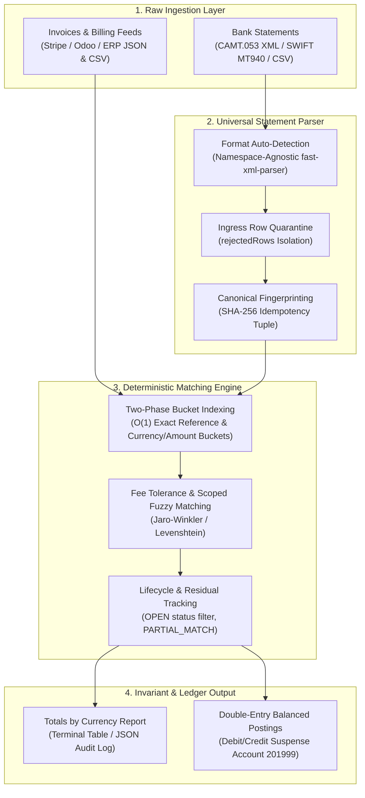

# ⚡ Reconciliation-as-Code (`recon-engine`)

> Stateless, Deterministic Reconciliation Engine & Parser Library (In-Memory Batch Matching for B2B SaaS).


[](https://bun.sh)
[](https://www.typescriptlang.org)
[](https://opensource.org/licenses/MIT)
[](./tests)
[](./AGENT.md)

> [!IMPORTANT]
> **Architectural Boundary & Positioning**: `recon-engine` is **not** a replacement for a General Ledger (GL) or core banking ledger. It is a stateless, deterministic reconciliation engine & parser library designed exclusively for pure in-memory batch calculations inside the user's own infrastructure. Double-entry bookkeeping, ledger balance mutations, and financial audit persistence remain strictly the responsibility of your primary database and GL.


---



---

## 💡 Why `recon-engine`?

Every B2B platform is stuck writing brittle, one-off glue scripts to parse bank statements (**CSV**, **CAMT.053 XML**, **SWIFT MT940**) and match them against invoices.

Heavy enterprise platforms cost $2,000+/mo and require months of sales calls. `recon-engine` gives you an instant, developer-first alternative that runs locally in milliseconds, runs in CI/CD, or embeds via CLI, TypeScript, and HTTP.

---

## 🚀 Quick Start (Zero Setup)

No installation required. Run directly with Bun:

### 1. Match Bank Statements to Invoices
```bash
# Auto-detect format and run interactive matching
bunx @danyayen/recon-engine match --statement bank-statement.csv --invoices invoices.json

# Auto-confirm all high-confidence matches (headless / CI)
bunx @danyayen/recon-engine match --statement bank.xml --invoices invoices.csv --yes --json
```

### 2. Parse Bank Statements Only
```bash
# Auto-detects CAMT.053 XML, SWIFT MT940, Revolut, or Stripe
bunx @danyayen/recon-engine parse statement.xml

# Output clean JSON for piping into jq or downstream services
bunx @danyayen/recon-engine parse statement.csv --json | jq .
```

### 3. Generate Mock Data for Testing
```bash
# Generate 50 realistic synthetic bank transactions with wire noise
bunx @danyayen/recon-engine mock --format camt053 --count 50 --noise 0.2 -o mock.xml
```

### 4. Run Headless HTTP Microservice
```bash
bunx @danyayen/recon-engine serve --port 3000
```

---

## ⚙️ Architecture & Matching Pipeline

`recon-engine` uses a high-performance 3-stage bucketed indexing pipeline to achieve \(O(N + M)\) performance instead of naive \(O(N \times M)\) comparisons:

1. **Stage 1 (O(1) Exact Reference & Partial Payments)**:
   - Evaluates normalized references against `exactRefMap: Map<string, NormalizedInvoice | 'AMBIGUOUS'>`.
   - Matches transactions referencing invoice numbers or EndToEndIds within date tolerance.
   - If reference matches but payment is underpaid beyond fee tolerance, flags as `PARTIAL_MATCH` and computes `remainingCents`.
2. **Stage 2 (O(1) Currency & Amount Bucket Match)**:
   - Looks up unassigned candidates directly from `bucketMap: Map<string, NormalizedInvoice[]>`, keyed by `${currency}:${amountCents}`.
   - Confirms matches based on booking date proximity (`|tx.date - inv.date| <= toleranceDays`) and IBAN / counterparty exact metrics.
3. **Stage 3 (Constrained Scoped Fuzzy & Wire Fee Tolerance)**:
   - Builds an inverted token index (`Map<token, Set<invoiceId>>`) to prune candidate string pairs before running expensive string distance algorithms.
   - Runs Jaro-Winkler string similarity exclusively on invoices sharing relevant remittance tokens.
   - Evaluates wire commission deductions (`FEE_TOLERANCE`) via binary range lookups on sorted amount arrays.
4. **Collision Resolution & Discrepancies**:
   - Competing transactions claiming the same invoice within close score deltas are safely demoted to `REVIEW_NEEDED` with clear human-readable discrepancies.

---

## 🤖 For AI Agents & LLMs

`recon-engine` is designed to be executed safely by coding agents (Cursor, Claude Code, Antigravity, OpenDevin):

- Feed [`AGENT.md`](./AGENT.md) or [`llms.txt`](./llms.txt) directly into your agent's context.
- Always pass `--json --non-interactive` (or `--yes`) flags to avoid interactive terminal prompts.
- **Zero Float Drift Guarantee**: All monetary amounts strictly use integer minor units (`amountCents: number`) to prevent IEEE 754 float precision errors.
- **Deterministic SHA-256 Fingerprints**: When statements lack unique bank IDs, `generateTransactionFingerprint()` generates canonical hashes for idempotency.
- **Batch Quarantine**: Parsers isolate corrupted rows into `rejectedRows` while successfully processing valid rows.
- **Invoice Lifecycle**: Only invoices with `status === 'OPEN'` are reconciled; others are categorized into `skippedInvoices` with `reason: 'INVOICE_NOT_OPEN'`.

---

## 🌍 Polyglot Integration (Python, Go, PHP)

### Python Subprocess (Atomic CLI)
```python
import subprocess, json

result = subprocess.run(
    ["bunx", "@danyayen/recon-engine", "match", "--statement", "bank.xml", "--invoices", "invoices.json", "--json", "--yes"],
    capture_output=True, text=True, check=True
)
report = json.loads(result.stdout)
print(f"Matched {report['summary']['matchedCount']} invoices!")
print("Totals by Currency:", report['summary']['totalsByCurrency'])
```

### HTTP Microservice (`POST /v1/match`)
```bash
curl -X POST http://localhost:3000/v1/match \
  -H "Content-Type: application/json" \
  -d '{"statement": "...", "invoices": [...] }'
```

---

## ⚡ Performance Benchmarks

Measured on Bun v1.3+ with synthetic production batches:

| Component / Format | Scale / Volume | Throughput | Latency | Precision Guarantee |
| :--- | :--- | :--- | :--- | :--- |
| **SWIFT MT940 Parser** | 1,000 txs | **~37,200 tx/sec** | **26.9 ms** | Zero Float Drift (Cents) |
| **Revolut Business CSV** | 1,000 txs | **~31,000 tx/sec** | **32.2 ms** | Auto-filters declined charges |
| **CAMT.053 XML Parser** | 1,000 txs | **~5,000 tx/sec** | **199.4 ms** | ISO 20022 compliant |
| **1:1 Matching Engine** | 1,000 pairs | **~47,500 pairs/sec** | **21.0 ms** | Exact Ref + Amount Buckets |
| **1:1 Matching Engine** | 5,000 pairs | **~25,300 pairs/sec** | **198.0 ms** | Bucketed candidate pruning |
| **1:1 Matching Engine** | 10,000 pairs | **~27,000 pairs/sec** | **370.0 ms** | O(N + M) candidate scaling |

---

## 🗺️ Upcoming Roadmap

- [ ] **DATEV & Accounting Export**: Automatic conversion of matched pairs into standard German DATEV CSV.
- [ ] **ECB Multi-Currency Tolerance**: On-the-fly EUR/USD conversion via ECB daily reference rates for FX reconciliation.
- [ ] **1:N & N:1 Settlement Graphs**: Multi-invoice aggregation and payment split reconciliation.
- [ ] **Append-Only Double-Entry Ledger**: Native immutable ledger plugin for BaaS platforms and escrow compliance.

---

## 🎯 Design Scope & Intentional Boundaries

`recon-engine` is purpose-built as a **fast, lightweight B2B statement reconciliation tool** to replace fragile ad-hoc scripts. It is not an enterprise clearinghouse like Modern Treasury or Visa DPS.

### Core Invariants & Decisions
- **100% Integer Minor Units**: To eliminate IEEE 754 float drift (`0.1 + 0.2 = 0.30000000000000004`), every monetary value is parsed, calculated, and exported strictly in integer minor units (`amountCents`).
- **Collision-Safe Fee Deductions**: Intermediary bank wire fees (e.g. €15 deduction on a €1,000 wire) are tracked explicitly via `feeDeductionCents` in the audit trail. When multiple invoices qualify for the same delta, matches are safely demoted to `REVIEW_NEEDED` instead of naively auto-confirming.
- **Deterministic Over Heuristic**: Tokenization and reference regex extraction always run before fuzzy fallbacks. Jaro-Winkler distance is strictly reserved for typo-tolerance in sanitized remittance strings.
- **Multi-Currency Totals**: Summaries group monetary values by currency code (`totalsByCurrency`) to avoid combining distinct currencies into meaningless scalar totals.

### What `recon-engine` Is NOT (Current Limitations & Non-Goals)
- **1:1 Focus (with Fee Tolerance & Residual Tracking)**: Currently optimized for 1:1 B2B invoice-to-transfer matching with intermediary fee deduction and partial payment residual tracking (`PARTIAL_MATCH`). Multi-transaction payout splits (1 payout closing 400 micro-orders) are planned for the v0.2 roadmap.
- **In-Memory Batch Architecture**: Designed for sub-second parsing of standard daily/monthly bank files (recommended up to ~25,000 transactions / ~25 MB per batch). Massive multi-gigabyte XML ledger exports require external chunking.
- **General Ledger Agnostic**: The engine outputs structured audit-trail JSON with status, match confidence, and fee delta. It does not enforce double-entry chart-of-accounts postings inside the engine itself (though ledger adapters are provided under `src/ledger/`).

---

## 📄 License

MIT © 2026
